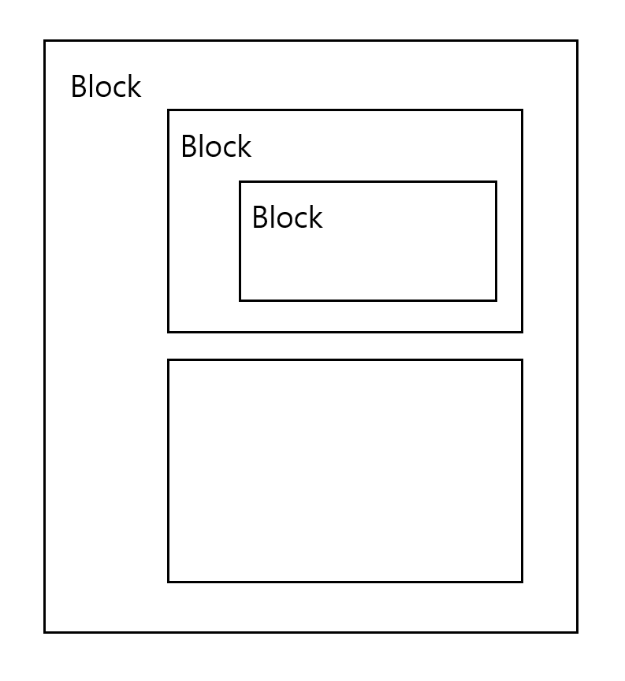
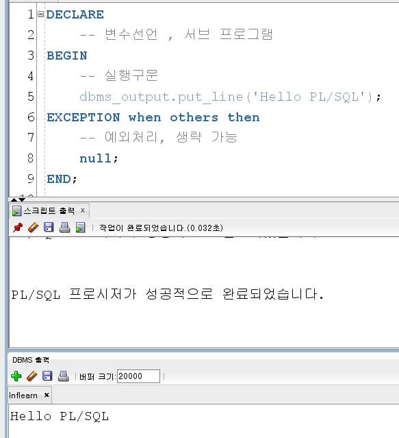
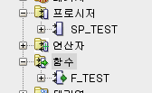

# PL/SQL 기본구조

## PL/SQL block - 익명 블록



```sql
DECLARE
    -- 변수선언, 서브 프로그램
    -- 바깥의 변수는 BEGIN문 안의 BEGIN문이 있다면 그 안에서도 이 선언한 변수를 사용할 수 있다.
    -- 변수가 없다면 DECLARE도 생략 가능하다.
BEGIN
    -- 실행구문   
    dbms_output.put_line('Hello PL/SQL');
    -- BEGIN문 안에는 블록을 추가로 넣을 수 있다. 그러면 블록 안의 블록이 된다.
    -- BEGIN문 안의 BEGIN문에서 에러 핸들링을 했다면, 그 핸들링한 부분에서 에러가 나거든 그대로 다음 내용으로 진행할 수 있다.
EXCEPTION when others then
    -- 예외처리, EXCEPTION문은 생략 가능하다.
    null;
END;
```




근데 이 구문들 쓸 때는 굳이 대문자로 써줄 필요는 없는 것 같다.

## 익명 블록에 이름을 붙여서 사용

DECLARE로 시작하는 익명 블록에 이름을 붙인 것이 FUNCTION, PROCEDURE이다.  
이름을 붙이게 되면 스키마에 저장된다. 즉, 하나의 오브젝트가 된다.

이 내용들은 DB를 다시 구동해도 그대로 있는 것이다. 그렇다는 것은 DB에 저장되어 있다는 것이 된다.
이 내용들을 Stored Procedure, Stored Function이라고 이름 붙인다.



붙일 수 있는 이름들
- function
- procedure
- package
- trigger

익명 블록은 에디터를 닫으면 저장을 하지 않았으니 없어진다.  
마치 어떤 프로그램을 파일을 만드는데, 파일 이름 없이 에디터에 계속 프로그래밍하는 것과 같다고 보면 된다.

만약 PL/SQL 구문을 만들었다면 저장을 해줘야 한다.


# 변수 선언

## 변수 선언 후 하드코딩 값 대입

DECLARE 문에 `변수이름 타입(크기);` 형식으로 변수를 선언할 수 있다.
이 변수를 로그로 찍으려면 변수 앞에 `||`를 붙이면 된다.

```sql
DECLARE
    v_name varchar2(100);
BEGIN
    -- 실행구문
    v_name := '홍길동2';
    dbms_output.put_line('Hello ' || v_name); -- Hello 홍길동2
END;
```

## BEGIN문 안의 into 키워드로 변수에 값 대입

BEGIN문 안에 select문으로 출력한 name을 into 키워드를 이용하여 선언했던 `v_name`에 값을 대입할 수 있다.

```sql
DECLARE
    v_name varchar2(100);
BEGIN
    -- 실행구문
    select name
    into v_name -- name과 타입이 일치해야 함.
    from sample
    where name = '홍길동';
    dbms_output.put_line('이름 : ' || v_name);
END;
```

## 해당 테이블의 컬럼 타입 따라가기

선언하려는 변수의 타입을 `해당테이블.이름%type`이라고 한다면 `해당테이블`의 `이름`의 타입이 변하더라도 그대로 사용할 수 있다.  
예를 들어, `sample.name%type`이라고 한다면 `sample` 테이블의 `name` 컬럼의 타입을 따라간다는 것이 된다.

```sql
DECLARE
    v_same_name sample.name%type;
BEGIN
    -- 실행구문
    select name
    into v_name -- name과 타입이 일치해야 함.
    from sample
    where name = '홍길동';
    dbms_output.put_line('이름 : ' || v_name);
END;
```

## rawtype

선언해야 할 변수가 너무 많을 것 같으면, 해당 테이블의 모든 컬럼을 한 번에 사용할 수 있다.
사용할 때는 `선언한변수.사용할_해당테이블의_컬럼`으로 사용한다.

예를 들어, 선언할 변수의 타입을 `sample%rawtype;`라고 하면 되며, 이를 사용하려면 `r_sample.name`이라고 사용한다. 

```sql
DECLARE
    r_sample sample%rawtype;
BEGIN
    -- 실행구문
    select name
    into r_sample.name
    from sample
    where name = '홍길동';
    dbms_output.put_line('이름 : ' || r_sample.name);
END;
```


## PL/SQL에서의 사이즈

테이블의 사이즈와 PL/SQL의 사이즈는 다르다.

예를 들어, 테이블의 varchar2 사이즈는 최대 4000 바이트이다.  
그런데 PL/SQL에서의 varchar2 사이즈는 32767 바이트를 사용할 수 있다. 훨씬 크다.

다만 테이블의 사이즈에 맞추는 게 좋다.


# 제어문

## IF문

조건 범위가 넓을 때 사용

```sql
IF 조건 Then
    dbms_output.put_line();
ELSIF 조건 Then
    dbms_output.put_line();
ELSE
    dbms_output.put_line();
END IF;
```

```sql
DECLARE
    -- 변수선언, 서브프로그램
    name varchar2(100) := '홍길동';
    age number(10) := 20;
BEGIN
    -- 실행구문
    name := '홍길동';
    age := 20;
    dbms_output.put_line('Hello ' || name || to_char(age));
    
    IF age < 13 Then
        dbms_output.put_line('초등학생');
    ELSIF age < 17 Then
        dbms_output.put_line('중학생');
    ELSE
        dbms_output.put_line('고등학생이상');
    END IF;
END;
```

## CASE문

범위가 좁을 때, 즉 정확한 하나의 값에 따라 사용

```sql
CASE selector(변수)
WHEN selector_value_1 THEN
    statements_1
WHEN selector_value_2 THEN
    statements_2
WHEN selector_value_n THEN
    statements_n
ELSE
    else_statements
END CASE;
```

```sql
DECLARE
    -- 변수 선언, 서브프로그램
    name varchar2(100) := '홍길동';
    age number(10) := 20;
BEGIN
    -- 실행구문
    name := '홍길동';
    age := 20;
    dbms_output.put_line('Hello ' || name || to_char(age));
    
    CASE age
    WHEN 13 THEN
        dbms_output.put_line('초등학생');
    WHEN 16 THEN
        dbms_output.put_line('중학생');
    WHEN 19 THEN
        dbms_output.put_line('고등학생');
    ELSE
        dbms_output.put_line('모름');
    END CASE;
END;
```

경우가 딱 맞아떨어지지 않다면 범위를 지정해서 사용할 수도 있다.
그런데 이렇게 쓸 거면 IF문이 차라리 낫다.

```sql
DECLARE
    -- 변수 선언, 서브프로그램
    name varchar2(100) := '홍길동';
    age number(10) := 20;
BEGIN
    -- 실행구문
    name := '홍길동';
    age := 20;
    dbms_output.put_line('Hello ' || name || to_char(age));
    
    CASE WHEN age < 13 THEN
        dbms_output.put_line('초등학생');
        WHEN age < 16 THEN
        dbms_output.put_line('중학생');
        WHEN age < 19 THEN
        dbms_output.put_line('고등학생');
        ELSE
        dbms_output.put_line('모름');
    END CASE;
END;
```

# 반복문

## LOOP

BEGIN문 안에 LOOP를 넣을 수 있다.
`LOOP`로 시작하고 `END LOOP`로 끝나며, 조건을 넣어서 루프를 빠져나가도록 해주면 된다.

```sql
DECLARE
    -- 변수선언, 서브프로그램
    name varchar2(100) := '홍길동';
    age number(10) := 20;
    x number := 0;
BEGIN
    -- 실행구문
    name := '홍길동';
    age := 20;
    dbms_output.put_line('Hello ' || name || to_char(age));
    
    LOOP
        x := x + 1;
        IF x < age THEN
            dbms_output.put_line('x 카운트 ' || x);
            continue;
        ELSE
            dbms_output.put_line('x 카운트 ' || x);
            exit;
        END IF;
            dbms_output.put_line('마지막 LOOP LINE');
            exit;
    END LOOP;
END;
```

빠져나가는 것은 `exit`를 활용해주면 되고, 빠져나가지 않으면 루프가 무한정 돌다가 오버플로우가 발생하게 된다.

exit로 빠져나가면 LOOP 안에 있던 그 뒤의 구문들은 실행되지 않는다.

`continue`도 사용할 수 있는데, 이 구문에 도달하면 일반 for문의 continue처럼 즉시 다음 회차로 넘어간다.

## FOR LOOP

Java의 for문을 생각하면 편하다. 초기값, 조건값(범위)이 있으며, exit, continue 등의 구문도 사용할 수 있다.

PL/SQL의 루프문 중에서는 제일 안전하다. 루프문을 써야 한다면 `FOR LOOP`문을 추천한다.

```sql
DECLARE
    -- 변수선언, 서브프로그램
    name varchar2(100) := '홍길동';
    age number(10) := 20;
    x number := 0;
BEGIN
    -- 실행구문
    name := '홍길동';
    age := 20;
    dbms_output.put_line('Hello ' || name || to_char(age));
    
    for x in 1..100 -- 1부터 100까지 진행
    LOOP
        IF x < age THEN
            dbms_output.put_line('다름 x 카운트 ' || x);
            continue;
        ELSE
            dbms_output.put_line('같음 x 카운트 ' || x);
            exit;
        END IF;
            dbms_output.put_line('마지막 LOOP LINE');
            exit;
    END LOOP;
END;
```

## WHILE LOOP

Java의 while문을 생각하면 편하다.
일정 조건이 참인 동안 루프를 계속 돈다.
소괄호는 굳이 안 써도 된다.

```sql
DECLARE
    -- 변수선언, 서브프로그램
    name varchar2(100) := '홍길동';
    age number(10) := 20;
    x number := 0;
BEGIN
    -- 실행구문
    name := '홍길동';
    age := 20;
    dbms_output.put_line('Hello ' || name || to_char(age));
    
    while x < age
    LOOP
        dbms_output.put_line('x count ' || x);
        x := x + 1;
    END LOOP;
END;
```

LOOP로 시작해놓고 내용에 `EXIT WHEN`이라고 놓고 조건 걸어주면, 그 조건에 맞았을 때 나갈 수 있다.

이 조건에 여러가지를 쓸 수 있는 상황이 생겨서 이 구문도 나름 유용하게 활용할 수 있다.

루프 사용은 조금 위험할 수 있다.

```sql
DECLARE
    -- 변수선언, 서브프로그램
    name varchar2(100) := '홍길동';
    age number(10) := 20;
    x number := 0;
BEGIN
    -- 실행구문
    name := '홍길동';
    age := 20;
    dbms_output.put_line('Hello ' || name || to_char(age));
    
    LOOP
        dbms_output.put_line('x count ' || x);
        x := x + 1;
        EXIT WHEN x = age;
    END LOOP;
END;
```

## 커서 FOR LOOP

`커서명`은 임의로 개발자가 명칭을 주면 된다.  
`DB 테이블 select`에는 select문을 넣으면 된다.

loop와 end loop 사이에 내용을 넣으면 된다.

```sql
for 커서명 in (DB 테이블 select)
loop
    statements;
end loop;
```

아래 PL/SQL문처럼 사용하면 된다.

```sql
begin
  for fc in (select * from tab)
    loop
        dbms_output.put_line(fc.name);
    end loop;
end;
```

# GOTO문

GOTO문이 개똥이라지만 그래도 GOTO문을 어떻게 쓰는지를 아는 것은 중요하다.
이렇게 쓰면 된다는 정도만 확인하고 넘어간다.

```sql
begin
  for fc in (select * from tab)
    loop
      dbms_output.put_line(fc.name);
    
      if fc.tname = 'orders' then -- orders라는 테이블 명칭을 받으면 이쪽으로 이동
          goto last_mission; -- last_mission으로 가라.
      end if;
      
    end loop;
    
    <<last_mission>> -- 예제의 goto문은 아래쪽에 정의했다.
      dbms_output.put_line('Goto move');
end;
```

이 라벨의 이름을 원하는 위치에 넣어준다.
예제에서는 루프문을 빠져나가야 하는 상황을 연출해 본 다음에 라벨을 만든다.
goto문을 루프문 위에 정의해놓고 실행하면 goto로 인해 위로 가고 다시 루프를 가는 무한 반복이 생기므로 무한 반복은 피해야 한다.


# NULL구문 (No Operation)

> The `NULL` statement only passes control to the next statement.
> Some languages refer to such an instruction as a no-op (no operation).

즉, 어느 곳에서나 써도 되는데 아무 의미 없다는 뜻이다.  
그럴거면 왜 쓰냐고 할 수 있는데, 쓰는 데는 의미가 있긴 하다.

```sql
begin
  for fc in (select * from tab)
    loop
      dbms_output.put_line(fc.tname);
      
      if fc.tname = 'orders' then -- orders라는 테이블 명칭을 받으면 이쪽으로 이동
        dbms_output.put_line(fc.tname);
        goto last_mission; -- last_mission으로 가라.
      else
        dbms_output.put_line(fc.tname);
      end if;
    end loop;
    
    <<last_mission>>
    dbms_output.put_line('Goto move');

    exception when other then
      null;
end;
```

예를 들어, else 문 안에 필요한 내용을 많이 넣었다고 쳤을 때, 이걸 주석처리해야 할 때도 있다.
그래서 주석을 다 쳐버리면, else 문 안의 내용이 비게 되어 문법 오류가 발생한다.

왜냐하면 else와 end if 사이에 아무것도 없는 걸로 인식되어서 문법 오류가 생긴다.

그럴 경우에 허수아비 놓는다 셈치고 `null`을 집어넣을 수 있다.
근데 이럴 거면 그냥 지우는 게 코드가 더 깔끔하게 되지 않나?

의외로 exception에서 자주 사용된다.
```sql
exception when other then
  null;
```
이렇게 exception이 발생해도 중요한 문장이 아니라는 뜻으로 null을 집어넣는다.

근데 이럴 거면 그냥 지우는 게 맞지 않나 라는 게 내 생각이긴 하다.