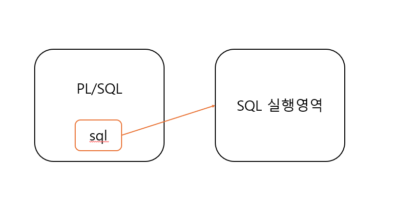

# Cursors & Collections 프롤로그

## Cursors Overview

A cursor is a pointer to a private SQL area that stores information about processing a specific SELECT or DML statement.

## Collection Types

PL/SQL has three collection types - associates array, VARRAY (variable-size array), and nested table.

# Implicit Cursor 묵시적 커서

## Implicit Cursors

> An Implicit cursor is a session cursor that is constructed and managed by PL/SQL.
> PL/SQL opens an implicit cursor every time you run a SELECT or DML statement.
> You cannot control an implicit cursor, but you can get imformation from its attributes.

> 묵시적 커서는 PL/SQL에 의해 생성되고 관리되는 세션 커서입니다.
> PL/SQL은 SELECT 또는 DML 문을 실행할 때마다 묵시적 커서를 엽니다.
> 묵시적 커서를 제어할 수는 없지만 해당 속성에서 정보를 얻을 수 있습니다.

- `SQL%ISOPEN` Attribute : Is the Cursor Open?
- `SQL%FOUND` Attribute : Were Any Rows Affected?
- `SQL%NOTFOUND` Attribute : Were No Rows Affected
- `SQL%ROWCOUNT` Attribute : How Many Rows Were Affected?


### 실습

커서를 사용하면 추가/삭제/수정을 했을 때 됐는지 안 됐는지 체크된다.

```sql
declare
  real_order_count number;
begin
  update real_order
  set register_day = sysdate
  where customer_id = 'C003'
  ;
  
  if sql%found then
    dbms_outut.put_line('Update 건수가 있음' || sql%rowcount);
  else
    --
  end if;
  
end;
```

`sql%found`를 하면 수행된 쿼리가 있는지에 대해서만 확인할 수 있다.
`sql%rowcount`는 적용된 행(커서)의 개수를 파악한다.

## Explicit Cursors

> An explicit cursor is a session cursor that you construct and manage.
> You must declare and define an explicit cursor, giving it a name and associating it with a query (typically, the query returns multiple rows).
> Then you can process the query result set in either of these ways :
> Open the explicit cursor (with the OPEN statement), fetch rows from the result set (with the FETCH statement), and close the explicit cursor (with the CLOSE statement).
> Use the explicit cursor in a cursor FOR LOOP statement (see "Processing Query Result Sets With Cursor FOR LOOP Statements").

### 예시

```sql
declare
    Cursor cursor_customer_info -- 커서 선언
        is select customer_id, name from customer_info; -- 정의

    v_customer_id customer_info.customer_id%type;
    v_name customer_info.name%type;

begin
    Open cursor_customer_info;
        Loop
            FETCH cursor_customer_info into v_customer_id, v_name;
            Exit When cursor_customer_info%NOTFOUND; -- 더이상 select 값이 없을 때까지
            dbms_output.put_line(v_customer_id || '-' || v_name);
        End Loop;
    Close cursor_customer_info;
end;
```

이번에는 for loop 구문을 활용해 암시적 커서를 사용해보겠다.
이때 이미 있던 `Open` 예약어를 안 지우고 for loop로 커서를 쓰려고 하면 예외가 발생한다.

ORA-06511: PL/SQL: cursor already open

```sql
declare
    p_customer_id varchar2(20) := 'C003'; -- null로 해주면 다 가져올 수 있음
    Cursor cursor_customer_info -- 커서 선언
        is select customer_id, name from customer_info where customer_id = nvl(p_customer_id, customer_id); -- select 구문을 실행하면 커서가 자동으로 실행됨

    v_customer_id customer_info.customer_id%type;
    v_name customer_info.name%type;

begin
    Open cursor_customer_info;
    For fc in cursor_customer_info
        Loop
            dbms_output.put_line(v_customer_id || '-' || v_name);
        End Loop;
    Close cursor_customer_info;
end;
```

`Open`, `Close`를 없애고 실행하면 정상적으로 동작한다.

```sql
declare
    p_customer_id varchar2(20) := null; -- null로 해주면 다 가져올 수 있음
    Cursor cursor_customer_info -- 커서 선언
        is select customer_id, name from customer_info where customer_id = nvl(p_customer_id, customer_id); -- select 구문을 실행하면 커서가 자동으로 실행됨

    v_customer_id customer_info.customer_id%type;
    v_name customer_info.name%type;

begin
    For fc in cursor_customer_info
        Loop
            dbms_output.put_line(fc.customer_id || '-' || fc.name);
        End Loop;
end;
```

```log
C001-홍길동1
C002-홍길동2
C003-홍길동3
C004-홍길동4
C005-홍길동5
```

선언했던 cursor를 줄여 이를 더 간략화할 수 있다.

```sql
declare
    p_customer_id varchar2(20) := null; -- null로 해주면 다 가져올 수 있음
begin
    For fc in (select customer_id, name from customer_info where customer_id = nvl(p_customer_id, customer_id))
        Loop
            dbms_output.put_line(fc.customer_id || '-' || fc.name);
        End Loop;
end;
```

### Cursor Variable Declarations

커서를 변수처럼 활용할 수도 있다.

```sql
declare
    type emp_current_type is ref cursor return employees%rowtype; -- strong type
    type generic_current_Type is ref cursor; -- weak type

    cursor1 emp_current_type; -- strong cursor variable
    cursor2 generic_current_type; -- weak cursor variable
    my_cursor sys_refcursor; -- weak cursor variable

    type department_current_type is ref cursor return departments%rowtype; -- strong type
    department_cursor_variable department_current_type -- strong cursor variable
begin
    null;
end;
```

`type emp_current_type is ref cursor return employees%rowtype` : 이 커서는 `employees`테이블의 값을 가져온다. RECORD 타입을 집어넣는다.  
`type generic_current_Type is ref cursor` : 리턴이 정의되지 않은 커서다. 어떤 거라도 넣어서 사용할 수 있다.  
`my_cursor sys_refcursor` : weak 타입에서 선언하고 변수를 가져오는 것을 하나로 만들어 준 게 sys_refcursor이다. 반환 값을 정해준 게 아닌데 선언과 변수 정의/선언을 한 번에 해주고 있다.  


#### 강한 타입 커서 활용

```sql
declare
    p_customer_id varchar2(20) := null; -- null로 해주면 다 가져올 수 있음
   
    type customer_current_type is ref cursor return customer_info%rowtype; -- strong type
    cursor_customer_info customer_current_type; -- 선언한 커서 변수를 가지고 실행하면 됨
    
    r_customer_info customer_info%rowtype;

begin
    Open cursor_customer_info
      for select * from customer_info where customer_id = nvl(p_customer_id, customer_id); -- cursor_customer_info 커서의 정의를 해줌
        Loop
            FETCH cursor_customer_info into r_customer_info;
            Exit When cursor_customer_info%NOTFOUND; -- 더이상 select 값이 없을 때까지
            dbms_output.put_line(r_customer_info.customer_id || '-' || r_customer_info.name);
        End Loop;
    Close cursor_customer_info;
end;
```

#### 약한 타입 커서 활용

```sql
declare
    p_customer_id varchar2(20) := null; -- null로 해주면 다 가져올 수 있음
   
    type customer_cursor_type is ref cursor; -- weak type
        cursor_customer_info customer_cursor_type;
        
    r_customer_info customer_info%rowtype;

begin
    Open cursor_customer_info -- 선언할 당시에는 알 수 없지만, 실행할 때 정의함
      for select * from customer_info where customer_id = nvl(p_customer_id, customer_id); -- cursor_customer_info 커서의 정의를 해줌
        Loop
            FETCH cursor_customer_info into r_customer_info;
            Exit When cursor_customer_info%NOTFOUND; -- 더이상 select 값이 없을 때까지
            dbms_output.put_line(r_customer_info.customer_id || '-' || r_customer_info.name);
        End Loop;
    Close cursor_customer_info;
end;
```


#### SYSTEM 꺼 활용

```sql
...
--    type customer_cursor_type is ref cursor; -- weak type
--      cursor_customer_info customer_cursor_type;
cursor_customer_info SYS_REFCURSOR; -- weak 타입을 쓸 거면 이걸 쓰자?
```

위의 weak 타입과 비슷하게 SYSTEM에서 제공해 주는 커서를 활용할 수 있다.

### 전역 커서로 만들어 활용

```sql
CREATE OR REPLACE
PACKAGE BODY PKG_SECTION_SEVEN AS

  /* strong type cursor */
  type customer_current_type is ref cursor return customer_info%rowtype;
  

  /* 프로시저, 커서 리턴 구문 */
  procedure psp_section_seven_cursor (
      p_customer_id in customer_info.customer_id%type
    , c_customer out customer_current_type
  )
  as
  begin
    /* strong type */
    open c_customer
      for select * from customer_info; -- c_customer의 값을 select해서 넣어주겠다
  end psp_section_seven_cursor;
  
  /* 명시적 커서, 변수 사용하기 */
  procedure psp_section_seven_cursor AS
    p_customer_id customer_info.customer_id%type; -- 고객ID
    c_customer customer_current_type; -- 커서 변수, strong type
    r_customer customer_info%rowtype; -- table 타입 레코드 변수
  BEGIN
    psp_section_seven_cursor(p_customer_id, c_customer);
    loop
        fetch c_customer into r_customer;
        exit when c_customer%notfound;
        dbms_output.put_line('Line : ' || r_customer.name);
    end loop;
    close c_customer;
  END psp_section_seven_cursor;

END PKG_SECTION_SEVEN;
```

어떤 자료를 가져와야 하는 게 공통으로 있는 상황에서, 커서를 활용하면 같은 커서를 불러와 동일한 값을 가져올 수 있다.

### RECORD를 활용한 커서

#### PKG_COMMON

```sql
create or replace PACKAGE PKG_COMMON AS 

  /* 패키지 내부 전역 레코드 - section 6 */
  type CustomerInfoRecordType is record (
      v_name customer_info.name%type
    , v_birth customer_info.birth%type
    , v_mobile customer_info.mobile%type
    , v_favorite varchar2(100)
  );
  
  /* strong type cursor - section 7 */
  type customer_current_type is ref cursor return customer_info%rowtype; 
  
  type record_cursor is ref cursor return CustomerInfoRecordType;
END PKG_COMMON;
```

#### 커서를 활용한 패키지 내 프로시저

```sql
create or replace PACKAGE BODY PKG_SECTION_SEVEN AS

  /* 프로시저, 커서 리턴 구문 */
  procedure psp_section_seven_cursor (
      p_customer_id in customer_info.customer_id%type
    , c_customer out PKG_COMMON.customer_current_type
  )
  as
  begin
    /* strong type */
    open c_customer
      for select * from customer_info; -- c_customer의 값을 select해서 넣어주겠다
  end psp_section_seven_cursor;
  
  /* 명시적 커서, 변수 사용하기 */
  procedure psp_section_seven_cursor AS
    p_customer_id customer_info.customer_id%type; -- 고객ID
    c_customer PKG_COMMON.customer_current_type; -- 커서 변수, strong type
    r_customer customer_info%rowtype; -- table 타입 레코드 변수
  BEGIN
    psp_section_seven_cursor(p_customer_id, c_customer);
    loop
        fetch c_customer into r_customer;
        exit when c_customer%notfound;
        dbms_output.put_line('Line : ' || r_customer.name);
    end loop;
    close c_customer;
  END psp_section_seven_cursor;

END PKG_SECTION_SEVEN;
```

#### 커서를 활용한 패키지 내 팡숀

```sql
create or replace PACKAGE BODY PKG_SECTION_SEVEN AS

  function pf_section_seven_cursor (
      p_customer_id in customer_info.customer_id%type
  ) return PKG_COMMON.record_cursor
  as
    -- 레코드 타입 변수
    record_cursor PKG_COMMON.record_cursor;
  begin
    /* strong type */
    open record_cursor -- select한 내용의 위치를 record_cursor가 포인터로 바라보고 있음. 이 커서를 넘겨주는 거임.
      for select name, birth, mobile, '커피' as favorite from customer_info where customer_id = nvl(p_customer_id, customer_id); 
    return record_cursor;
  end pf_section_seven_cursor;

  /* 프로시저, 커서 리턴 구문 */
  procedure psp_section_seven_cursor (
      p_customer_id in customer_info.customer_id%type
    , c_customer out PKG_COMMON.customer_current_type
  )
  as
  begin
    /* strong type */
    open c_customer
      for select * from customer_info; -- c_customer의 값을 select해서 넣어주겠다
  end psp_section_seven_cursor;
  
  /* 명시적 커서, 변수 사용하기 */
  procedure psp_section_seven_cursor AS
    p_customer_id customer_info.customer_id%type; -- 고객ID
    c_customer PKG_COMMON.customer_current_type; -- 커서 변수, strong type
    r_customer customer_info%rowtype; -- table 타입 레코드 변수
    
    record_cursor PKG_COMMON.record_cursor;
    record_customer_info PKG_COMMON.CustomerInfoRecordType; -- 하나의 RECORD SET
  BEGIN
  
    /* strong, record type 커서 return */
    record_cursor := pf_section_seven_cursor(p_customer_id);
    loop
        fetch record_cursor into record_customer_info;
        exit when record_cursor%notfound;
        dbms_output.put_line('Line : ' || record_customer_info.v_mobile);
        dbms_output.put_line('Line : ' || record_customer_info.v_favorite);
    end loop;
    close record_cursor;
    
    /* strong type 변수 return */
    psp_section_seven_cursor(p_customer_id, c_customer);
    loop
        fetch c_customer into r_customer;
        exit when c_customer%notfound;
        dbms_output.put_line('Line : ' || r_customer.name);
    end loop;
    close c_customer;
  END psp_section_seven_cursor;

END PKG_SECTION_SEVEN;
```

```sql
begin
  pkg_section_seven.psp_section_seven_cursor;
end;
```

```log
Line : 010-0000-1111
Line : 커피
Line : 010-0000-1112
Line : 커피
Line : 010-0000-1113
Line : 커피
Line : 010-0000-1114
Line : 커피
Line : 010-0000-1115
Line : 커피
Line : 홍길동1
Line : 홍길동2
Line : 홍길동3
Line : 홍길동4
Line : 홍길동5
```

커서를 사용하면서 주의해야 할 점은

```sql
function pf_section_seven_cursor (
    p_customer_id in customer_info.customer_id%type
) return PKG_COMMON.record_cursor
as
-- 레코드 타입 변수
record_cursor PKG_COMMON.record_cursor;
begin
/* strong type */
open record_cursor -- select한 내용의 위치를 record_cursor가 포인터로 바라보고 있음. 이 커서를 넘겨주는 거임.
    for select name, birth, mobile, '커피' as favorite from customer_info where customer_id = nvl(p_customer_id, customer_id); 
-- close record_cursor -- ORA-01001: invalid cursor
return record_cursor;
end pf_section_seven_cursor;
```

이렇게 커서를 Open 했는데 반환 하기도 전에 Close로 닫아버리면 안 된다.
return 전에 close로 닫아버리면 닫힌 상태로 커서가 넘어가기 때문에 실행되지 않는다.

프로시저도 마찬가지로 다음 프로시저에서 사용하기 전에 닫아버리면 예외가 발생한다.

```sql
/* 프로시저, 커서 리턴 구문 */
procedure psp_section_seven_cursor (
    p_customer_id in customer_info.customer_id%type
  , c_customer out PKG_COMMON.customer_current_type
)
as
begin
/* strong type */
open c_customer
    for select * from customer_info; -- c_customer의 값을 select해서 넣어주겠다
-- close c_customer -- ORA-01001: invalid cursor
end psp_section_seven_cursor;
```

커서를 사용할 때는 Open, Fetch, Close에 대한 내용을 정확하게 인지하고 사용해야 한다.

#### 유용한 실무 팁

어떤 팡숀에 내가 원하는 값을 가져오는 공통 팡숀을 만든다.

```sql
select *
from real_order a
inner join customer_info b
        on a.customer_id = b.customer_id
where a.order_no = '1000065';
```

위 select문처럼 한 행만 가져오는 경우에는 프로시저에 있던 Loop문을 빼고 FETCH만 남겨두면 된다.
값을 가져와서 한 번만 뿌리고 close로 커서를 닫아버리면 된다.

```sql
/* 명시적 커서, 변수 사용하기 */
procedure psp_section_seven_cursor AS
...
/* strong type 변수 return */
psp_section_seven_cursor(p_customer_id, c_customer);
--    loop
    fetch c_customer into r_customer;
--    exit when c_customer%notfound;
    dbms_output.put_line('Line : ' || r_customer.name);
--    end loop;
close c_customer;
END psp_section_seven_cursor;
```

이런 경우에는 RECORD를 활용할 수 있겠지만, RECORD는 타입이 정해져있는 strong 타입이기 때문에, 커서의 weak type을 이용할 수 있다.
어떻게 값이 올지 모르지만 미리 선언할 수 있다.

```sql
create or replace PACKAGE PKG_COMMON AS 
  ...
  
  /* weak type */
  type return_cursor is ref cursor;
  
  ...
END PKG_COMMON;
```

이렇게 선언한 커서는 LOOP를 돌리지 않은 FETCH를 써서 한 행만 가져오도록, RECORD SET보다 유연하게 사용할 수 있다.

# Collections 개념

Cursor와 Collection은 배열처럼 아래로 내용을 multi row로 가져갈 수 있다는 공통점이 있다.

## Associative

```sql
type Capital is table of varchar2(50) -- Associative array type
--              index by varchar2(50);   -- char type indexed by string
                index by pls_integer;    -- only number type key
```


```sql
/* Associative array Sample */
declare
    -- Associative array indexed by string:
    
    type Capital is table of varchar2(50) -- Associative array type, value
                 index by varchar2(50);   -- indexed by string, key
    city_capital Capital;                 -- Associative array variable
    v_index varchar2(50);                 -- Scalar variable
begin
    -- Add elements (key-value pairs) to associative array:
    
    city_capital('한국') := '서울';
    city_capital('프랑스') := '파리';
    city_capital('영국') := '런던';
    
    dbms_output.put_line(city_capital('한국'));
    
    -- print associative array:
    v_index := city_capital.first; -- get first element of array
    while v_index is not null loop
        dbms_output.put_line('population of ' || v_index || ' is ' || city_capital(v_index));
        v_index := city_capital.next(v_index); -- get next element of array
    end loop;
end;
```


## Varray

Associative와 기능이 거의 동일하지만 Varray는 크기를 꼭 선언해야 한다.  
또한 loop문을 이용하여 개수만큼 값을 가져온다.

```sql
type Capital is varray(10) of varchar2(50);
```

```sql
/* Varrays (Variable-Size Arrays) Sample */
declare
    type Capital is varray(10) of varchar2(50); -- Varrays (Variable-Size Arrays) type
    city_capital Capital := Capital('서울', '파리', '런던'); -- Varrays variable
begin
    for i in 1..city_capital.count loop
        dbms_output.put_line(city_capital(i));
    end loop;
end;
```

## Nested Table

```sql
/* Nested Tables Sample */
declare
    type Capital is table of varchar2(20); -- nested table type

    -- nested table variable initialized with constructor:
    city_capital Capital := Capital('서울', '파리', '런던');
begin
    for i in city_capital.first .. city_capital.last loop -- for first to last element
        dbms_output.put_line(city_capital(i));
    end loop;

    dbms_output.put_line('---');
end;
```


## 공통 코드로 실습

### 패키지 헤더(Specification)

```sql
create or replace PACKAGE PKG_COMMON AS 

  /* 패키지 내부 전역 레코드 - section 6 */
  type CustomerInfoRecordType is record (
      v_name customer_info.name%type
    , v_birth customer_info.birth%type
    , v_mobile customer_info.mobile%type
    , v_favorite varchar2(100)
  );
  
  /* weak type */
  type return_cursor is ref cursor;
  
  /* strong type cursor - section 7 */
  type customer_current_type is ref cursor return customer_info%rowtype; 
  
  type record_cursor is ref cursor return CustomerInfoRecordType;

  /* Associative array */
  type Capital is table of varchar2(50) -- Associative array type
                  index by varchar2(50); -- char type indexed by string
               -- index by pls_integer; -- only number type key
  -- city_capital Capital := Capital('한국' => '서울'); -- 이거는 12g부터 가능한 문법
  
  PROCEDURE set_city_capital(cities Capital);
  FUNCTION get_city_capital RETURN Capital;
  
END PKG_COMMON;
```

### 패키지 바디

```sql
create or replace PACKAGE BODY PKG_COMMON AS
    city_capital Capital;
    
    PROCEDURE set_city_capital(cities Capital) IS
    BEGIN
        city_capital := cities;
    END set_city_capital;
    
    FUNCTION get_city_capital RETURN Capital IS
    BEGIN
        RETURN city_capital;
    END get_city_capital;
END PKG_COMMON;
```

### 호출 블럭 구문

```sql
DECLARE
  temp_city_capital PKG_COMMON.Capital;
  v_index varchar2(50);    -- Scalar variable
BEGIN
  temp_city_capital('한국') := '서울';
  temp_city_capital('프랑스') := '파리';
  temp_city_capital('영국') := '런던';
  
  PKG_COMMON.set_city_capital(temp_city_capital);
  
  dbms_output.put_line(temp_city_capital('한국'));
  -- print associative array:
  v_index := temp_city_capital.first; -- get first element of array
  while v_index is not null loop
      dbms_output.put_line('population of ' || v_index || ' is ' || temp_city_capital(v_index));
      v_index := temp_city_capital.next(v_index); -- get next element of array
  end loop;
END;
```

# Collections - 객체(Table, Record, Cursor 등) 사용

## 단순 문자열을 사용하는 경우

### Associative array

```sql
type Capital is table of varchar2(50) index by varchar2(64);
city_capital Capital;
city_capital('한국') := '서울';
city_capital('프랑스') := '파리';
city_capital('영국') := '런던';
```

### Varrays

```sql
type Capital is varray(10) of varchar2(50);
city_capital Capital := Capital('서울', '파리', '런던');
```

### Nested Tables

```sql
type Capital is table of varchar2(20);
-- nested table variable initialized with constructor.
city_capital Capital := Capital('서울', '파리', '런던');
```

## Collectios 확장 - DB Table 입력

```sql
type Capital is table of varchar2(20); -- varchar2(20) 문자열
type Capital is table of customer_info%rowtype; -- customer_info table
```

### Sample1

```sql
declare
    type nl_customer_info is table of customer_info%rowtype;
    l_customer_info nl_customer_info := nl_customer_info(); -- 초기화
begin
    for fc in (select * from customer_info)
    loop
        l_customer_info.extend;
        l_customer_info(l_customer_info.last).customer_id := fc.customer_id;
        l_customer_info(l_customer_info.last).name := fc.name;
        l_customer_info(l_customer_info.last).birth := fc.birth;

        dbms_output.put_line(fc.customer_id);
    end loop;

    dbms_output.put_line(chr(10) || chr(13));

    for idx in l_customer_info.first .. l_customer_info.count
    loop
        dbms_output.put_line(l_customer_info(idx).customer_id);
        dbms_output.put_line(l_customer_info(idx).name);
        dbms_output.put_line(chr(10) || chr(13));
    end loop;
end;
```

위의 pl/sql문에서 대량의 데이터를 처리할 경우에는 `bulk collect into forall`을 사용하면 좋다.
`extend`나 `last`를 사용하지 않아도 편하게 같은 기능을 기대할 수 있다.

### Sample2

```sql
declare
    type nl_customer_info is table of customer_info%rowtype;
    l_customer_info nl_customer_info := nl_customer_info(); -- 초기화
begin
    select *
    bulk collect into l_customer_info
    from customer_info;
    
    for idx in l_customer_info.first .. l_customer_info.count
    loop
        dbms_output.put_line(l_customer_info(idx).customer_id);
        dbms_output.put_line(l_customer_info(idx).name);
    end loop;
end;
```

`bulk collect into`를 쓰면 Collection 타입의 값을 한 번에 집어넣을 수 있다.

#### bulk insert 테스트

##### 테스트 테이블 생성

```sql
create table customer_info_temp as select * from customer_info;

delete from customer_info_temp;
```

##### for문을 이용하여 bulk insert했던 데이터 temp 테이블에 insert

```sql
declare
    type nl_customer_info is table of customer_info%rowtype;
    l_customer_info nl_customer_info := nl_customer_info(); -- 초기화
begin
    select *
    bulk collect into l_customer_info
    from customer_info;
    
    for idx in l_customer_info.first .. l_customer_info.count
    loop
        insert into customer_info_temp (
            customer_id
          , name
          , birth
          , mobile
          , point
          , register_day
        ) values (
            l_customer_info(idx).customer_id
          , l_customer_info(idx).name
          , l_customer_info(idx).birth
          , l_customer_info(idx).mobile
          , l_customer_info(idx).point
          , l_customer_info(idx).register_day
        );
    end loop;
end;
```

위의 구문에서는 for문에 loop, end loop문으로 감쌌지만, `forall`로 하면 감쌀 필요가 없어진다.
`forall`은 `bulk insert into`와는 상관없다.

`forall`은 record 타입의 값을 한꺼번에 집어넣는 역할을 한다.  
collection 변수 타입의 값을 한꺼번에 넣을 수 있는 기능이다.
또한, 하나의 dml만 처리할 수 있다.

```sql
declare
    type nl_customer_info is table of customer_info%rowtype;
    l_customer_info nl_customer_info := nl_customer_info(); -- 초기화
begin
    select *
    bulk collect into l_customer_info
    from customer_info;
    
    forall idx in l_customer_info.first .. l_customer_info.count
        insert into customer_info_temp (
            customer_id
          , name
          , birth
          , mobile
          , point
          , register_day
        ) values (
            l_customer_info(idx).customer_id
          , l_customer_info(idx).name
          , l_customer_info(idx).birth
          , l_customer_info(idx).mobile
          , l_customer_info(idx).point
          , l_customer_info(idx).register_day
        );
end;
```



> 그냥 for in에 loop문을 써도 될텐데 왜 `bulk insert`, `forall`이 나온 걸까?
>
> Oracle Database 개발자가 작성하는 거의 모든 프로그램에는 PL/SQL 및 SQL문이 모두 포함되어 있다.
> PL/SQL문은 PL/SQL문 실행기에 의해 실행된다.
> SQL문은 SQL문 실행 프로그램에 의해 실행된다.
> PL/SQL 런타임 엔진은 SQL문을 발견하면 중지하고 SQL문을 SQL 엔진으로 전달한다.
> SQL 엔진은 SQL문을 실행하고 정보를 다시 PL/SQL 엔진으로 반환한다.
> 이러한 제어 전송을 컨텍스트 스위치라고 하며, 이러한 스위치 각각은 프로그램의 전체 성능을 저하시키는 오버헤드를 발생시킨다.

```sql
declare

begin
    for fc in (select * from customer_info) -- 소량의 데이터를 넣을 때는 괜찮지만, 대량의 데이터를 넣을 때는 위험하다.
    loop
        insert into customer_info_temp (
            customer_id
          , name
          , birth
          , mobile
          , point
          , register_day
        ) values (
            fc.customer_id
          , fc.name
          , fc.birth
          , fc.mobile
          , fc.point
          , fc.register_day
        )
    end loop;
end;
```

대량의 처리가 필요한 경우에는 `bulk insert`, `forall` 등의 기능을 활용하면 좋다.

## Collections - Bulk collect into - limit

Array에 100만처럼 대량의 데이터를 집어넣는다면, Array 객체의 사이즈가 커질수록 메모리의 부담이 증가한다.
이에 대한 해결책으로는 `limit`이 있다.

`limit`을 사용하면 `bulk insert`등을 할 때 한 번에 넣지 않고 필요에 따라 메모리에 부담되지 않게 처리하면서 빠른 처리를 기대할 수 있다.

### limit Sample

```sql
declare
    type nl_customer_info is table of customer_info%rowtype;
    l_customer_info nl_customer_info := nl_customer_info();

    my_cursor sys_refcursor; -- weak cursor variable
begin
    open my_cursor for select * from customer_info;

    loop
    fetch my_cursor bulk collect into l_customer_info limit 2; -- 2개씩 가져와서 친다
        forall idx in l_customer_info.first .. l_customer_info.count
            insert into customer_info_temp (
                customer_id
              , name
              , birth
              , mobile
              , point
              , register_day  
            ) values (
                l_customer_info(idx).customer_id
              , l_customer_info(idx).name
              , l_customer_info(idx).birth
              , l_customer_info(idx).mobile
              , l_customer_info(idx).point
              , l_customer_info(idx).register_day  
            );
    exit when my_cursor%notfound;
    end loop;

    close my_cursor;
end;
```