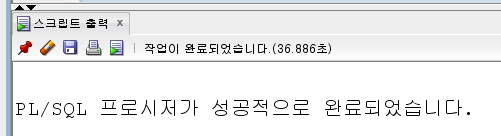

# 데이터 100만개 넣어보기

원활한 테스트를 위해서 많은 데이터를 넣되, 한 데이터의 PK값에 몰빵하는 데이터가 되는 등의 더미 데이터는 올바르지 못한 테스트로 이어질 수 있다.

랜덤하게 넣어 고른 더미 데이터를 만들어 볼 것이다.

```sql
-- 주문서를 생성한다.
declare
    r_customer_info customer_info%rowtype;
    r_menu menu%rowtype;
    
begin
    -- for 구문
    for idx in 1 .. 100000 
    select *
      into r_customer_info
    from customer_info
    order by dbms_random.random;
    ...
```

위와 같이 실행한다면 5개짜리에서 하나만 나와야 하는데 너무 많은 값이 나와서 오류가 발생하게 된다.

```sql
...
begin
    -- for 구문
    for idx in 1 .. 100000
        select *
        from (
              select *
                into r_customer_info
              from customer_info
              order by dbms_random.random
             )
        where rownum = 1
    ...
```

이렇게 한다면 한 행만 나와서 이전의 코드보다 수월하게 진행될 것이다.

`dbms_random.random`는 랜덤함수이다.

```sql
declare
    r_customer_info customer_info%rowtype;
    r_menu menu%rowtype;
    v_num number(10); -- 주문수량
begin
    -- for 구문
    for idx in 1 .. 1000000
    loop
        select *
        into r_customer_info
        from (
              select *
              from customer_info
              order by dbms_random.random
             )
        where rownum = 1
        ;
        
        select *
          into r_menu
        from (
              select *
              from menu
              order by dbms_random.random
             )
        where rownum = 1
        ;
        
        v_num := round(dbms_random.value(1, 10));
        -- 주문서를 생성한다.
        insert into real_order (
            order_sequence
          , customer_id
          , menu_id
          , menu_size
          , menu_ice
          , quantity
          , price
          , total_price
          , point_use
          , point_add
        ) values (
            1
          , r_customer_info.customer_id
          , r_menu.menu_id
          , 'N'
          , 'N'
          , v_num
          , r_menu.menu_price
          , v_num * r_menu.menu_price
          , 0
          , 0
        );
    end loop;
    
    commit;
end;
```

실행해보면 정상적으로 된 걸 확인할 수 있다. 아무래도 많은 양의 데이터를 넣어야 해서 시간이 좀 걸린다.

왜냐하면 select도 100만 번을 수행하기 때문이다.

이럴 때는 collection의 nested table을 활용할 수 있다.

```sql
-- 고객정보 Nested Table - Collection
type NestedTableCustomerInfo is table of customer_info%rowtype;
r_customer_info NestedTableCustomerInfo := NestedTableCustomerInfo();

-- 메뉴정보 Nested Table - Collection
type NestedTableMenu is table of menu%rowtype;
r_menu NestedTableMenu := NestedTableMenu();
```

테이블의 값을 nested table을 정의한 뒤 모두 넣을 것이다. 그래서 for문이 100만번 수행될 동안 테이블을 select하지 않도록 할 것이다.

nested table의 배열에서 데이터를 가져오도록 만드는 것이다.  
select를 하지 않으므로 성능이 더 좋아질 것이다.

또한 for문을 100만번 돌리는 것보다 한 번에 때려넣는 `bulk collect into`를 활용하면 성능이 좋아진다.

```sql
-- 주문서 생성
declare
    -- 고객정보 Nested Table - Collection
    type NestedTableCustomerInfo is table of customer_info%rowtype;
    r_customer_info NestedTableCustomerInfo := NestedTableCustomerInfo();
    
    -- 메뉴정보 Nested Table - Collection
    type NestedTableMenu is table of menu%rowtype;
    r_menu NestedTableMenu := NestedTableMenu();
    
    -- 랜덤숫자
    customer_number number(10);
    menu_number number(10);
begin
    -- 고객정보
    select *
    bulk collect into r_customer_info -- 한 번만 실행할 것이므로 for문 밖에 놓음
    from customer_info
    order by customer_id -- 배열에 들어갈 때 순서를 정해주면 좋으므로
    ;
    
    -- 메뉴정보
    select *
    bulk collect into r_menu
    from menu
    order by menu_id
    ;
...
```

배열에 데이터는 순서대로 집어넣었지만, 값을 랜덤하게 뽑아와야, 가져와야 하므로 랜덤함수를 사용한다.

```sql
-- for 구문
for idx in 1 .. 1000000
loop
    customer_number := round(dbms_random.value(1, 5)); -- 테이블에는 5개 데이터만 있으므로
    menu_number := round(dbms_random.value(1, 5)); -- 테이블에는 5개 데이터만 있으므로
    ...
```

쿼리를 다 작성하면 아래와 같다.

```sql
-- 주문서 생성
declare
    -- 고객정보 Nested Table - Collection
    type NestedTableCustomerInfo is table of customer_info%rowtype;
    r_customer_info NestedTableCustomerInfo := NestedTableCustomerInfo();
    
    -- 메뉴정보 Nested Table - Collection
    type NestedTableMenu is table of menu%rowtype;
    r_menu NestedTableMenu := NestedTableMenu();
    
    -- 랜덤숫자
    customer_number number(10);
    menu_number number(10);
begin
    -- 고객정보
    select *
    bulk collect into r_customer_info -- 한 번만 실행할 것이므로 for문 밖에 놓음
    from customer_info
    order by customer_id -- 배열에 들어갈 때 순서를 정해주면 좋으므로
    ;
    
    -- 메뉴정보
    select *
    bulk collect into r_menu
    from menu
    order by menu_id
    ;
    -- for 구문
    for idx in 1 .. 1000000
    loop
        customer_number := round(dbms_random.value(1, 5));
        menu_number := round(dbms_random.value(1, 5));
        
        v_number := round(dbms_random.value(1, 1000)); -- 주문수량
        -- 주문서를 생성한다.
        insert into real_order (
            order_sequence
          , customer_id
          , menu_id
          , menu_size
          , menu_ice
          , quantity
          , price
          , total_price
          , point_use
          , point_add
        ) values (
            1
          , r_customer_info(customer_number).customer_id -- customer_id 가져올 때는 이 랜덤함수 값을 이용해서 인덱스를 넣어주고 값을 가져오게 한다.
          , r_menu(menu_number).menu_id -- menu_id 가져올 때는 이 랜덤함수 값을 이용해서 인덱스를 넣어주고 값을 가져오게 한다.
          , 'N'
          , 'N'
          , v_number
          , r_menu(menu_number).menu_price
          , v_number * r_menu(menu_number).menu_price
          , 0
          , 0
        );
    end loop;
    
    commit;
end;
```

쿼리를 수행하기 전에 `real_order`테이블의 데이터를 깔끔하게 지워준다.

```sql
truncate table real_order drop storage;
```



이전에 백만 번의 for문에 select 두 개, insert문까지 해서 1분 조금 안 되게 걸렸지만, 지금은 insert만 100만번 돌리면 되므로 시간도 반으로 절약됐다.