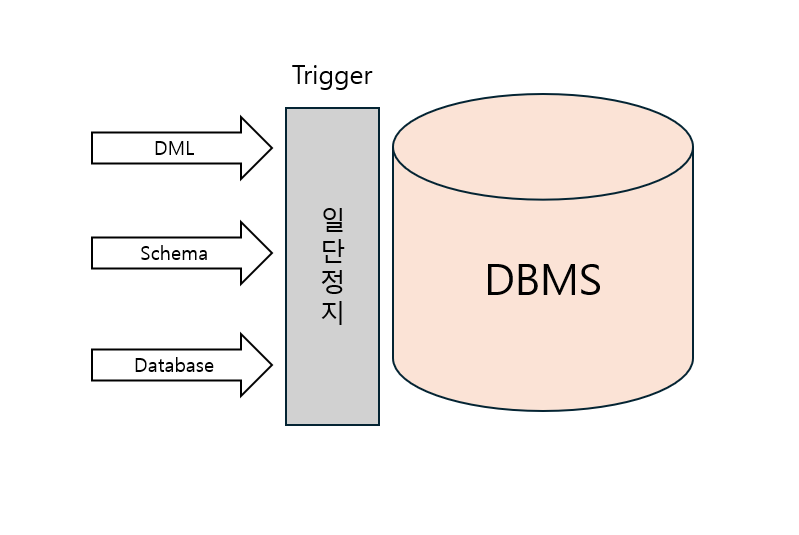
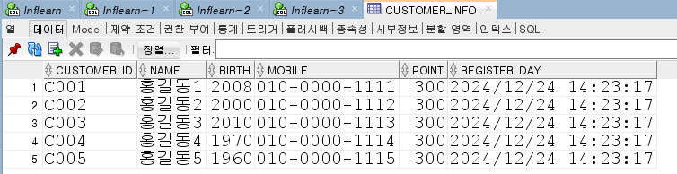
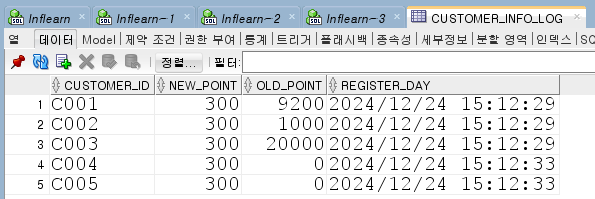

# Trigger 개요

> A trigger is like a stroed procedure that oracle database invokes automatically whenever a specified event occurs.

> 트리거는 지정된 이벤트가 발생할 때마다 오라클 데이터베이스가 호출하는 저장 프로시저와 같다.

- DB 운영자 입장에서 App/DB 개발자로부터 DB를 관리하는 DB 관리의 마지막 보루
- DML 뿐만 아니라 DDL Level까지 통제가 가능



트리거가 필요한 경우/예시는 다음과 같다.
- delete를 해서는 안 되는 테이블이 있다면 프로그램에서 막을 수도 있다. 즉, 테이블 만들 때 제약조건을 넣을 수도 있고, 애플리케이션 단에서 막을 수도 있다.
  - 하지만 이것만 해도 믿을 수 없다면 DB단에서 트리거를 통해 최종적으로 대비할 수 있다.

트리거는 스키마 단까지 가능하다.  
운영할 때 truncate를 테이블에 맘대로 수행하면 안 되는 경우나 drop을 하면 안 된다는 등에 대해 통제할 수 있다.  
또한 트리거는 로그도 남길 수 있다.

# DML Trigger

```sql
create or replace trigger 트리거이름
    [필수] before or after -- 트리거의 발생 시점. 보통 before를 많이 쓴다.
    [필수] delete or insert or update on 테이블명 -- 3개를 선택해서 사용 (insert/update/delete)
    [선택] referencing new as new old as old -- new, old에 대한 alias 사용 가능 - new는 새로 들어온 값, old는 기존에 있던 값
    [선택] for each row [statement] -- 테이블에 어떤 이벤트가 발생했을 때 그 명령 단위를 한 번만 실행되게 할 건지, row별로 처리하게 할지 선택. 생략될 경우 statement 실행
                                    -- statement : 해당 이벤트에 한 번만 실행됨
    [선택] when (new.column = 'XXX') -- 트리거의 조건을 생성. 어떠한 상태일 때만 실행되어라. ex) when (new.customer_id = 'C001') : customer_id가 'C001'일 때만 실행되어라

    declare -- PL/SQL 구문
        n number;
    begin
        -- new : 새로 추가되거나 변경된 후의 값에 트리거가 적용된다.(insert : 입력할 값, update : 수정할 값)
        -- old : 변경 전의 값에 트리거가 적용된다. (update : 수정 전 값, delete : 삭제할 값)
        if inserting then ~ : -- insert가 되는 시점에 ~를 해라. insert 이벤트 실행
        elsif updating then ~ : -- update가 되는 시점에 ~를 해라. update 이벤트 실행
        elsif deleting then ~ : -- delete가 되는 시점에 ~를 해라. delete 이벤트 실행
        end if;
    end;
```

트리거는 꼭 필요한 것만 넣어야 한다.
delete/insert/update 어느 것이든 or로 다 사용하든 여러 번 너무 자주 사용되면 성능에 문제가 발생하기 때문이다.

```sql
create or replace trigger trigger_customer_info
    before
    delete or insert or update on customer_info -- 3개 모두 or로 사용 가능
    
    declare
        n number;
    begin
        if inserting then dbms_output.put_line('trigger_departments_before - insert');
        elsif updating then dbms_output.put_line('trigger_departments_before - update');
        elsif deleting then RAISE_APPLICATION_ERROR(-20001, 'Dont delete this table');
        end if;
        
    end;
```

테스트용 트리거를 만들었다.

```sql
select *
from customer_info;

update customer_info
set register_day = sysdate;
```
그런 뒤 update를 치면

```log
5개 행 이(가) 업데이트되었습니다.
```
라는 기존 테이블에 있던 데이터 5행에 대한 업데이트 완료 알림과

```log
trigger_departments_before - update
```

로그로 찍은 게 나온다.

근데 로그가 한 번 찍혔으므로 이벤트는 한 번만 실행된 것으로 볼 수 있다.

트리거 옵션 중 `for each row`를 설정하지 않아서 이벤트를 하나로 뭉탱이 쳐버린 것이다.

`for each row`를 설정하고 실행하면 테이블에 있던 데이터 행의 개수만큼 이벤트 로그가 찍힌 것을 확인할 수 있다.

```log
trigger_departments_before - update
trigger_departments_before - update
trigger_departments_before - update
trigger_departments_before - update
trigger_departments_before - update
```

이는 상황에 따라 뭉탱이로 칠지 각 데이터 행마다 칠지 선택하면 된다.

delete를 하면 다음과 같이 dml 실행이 막히는 것을 확인할 수 있다.

```sql
delete from customer_info;
```

```log
ORA-20001: Dont delete this table
ORA-06512: at "INFLEARN.TRIGGER_CUSTOMER_INFO", line 6
ORA-04088: error during execution of trigger 'INFLEARN.TRIGGER_CUSTOMER_INFO'
```

새로 들어오거나 수정할 때 일정 값에 대한 유효성 처리를 하고 싶다면 다음과 같이 처리할 수 있다.

```sql
create or replace trigger trigger_customer_info
    before
    delete or insert or update on customer_info -- 3개 모두 or로 사용 가능
    for each row
    declare
        n number;
    begin
        if inserting then dbms_output.put_line('trigger_departments_before - insert');
        elsif updating then dbms_output.put_line('trigger_departments_before - update');
        elsif deleting then RAISE_APPLICATION_ERROR(-20001, 'Dont delete this table');
        end if;
        
        if(inserting or updating) and :new.point > 100000 then
            RAISE_APPLICATION_ERROR(-20001, 'Point 100000 overis error!');
        end if;
        
    end;
```

이때는 dml 을 테이블에 대해서만 있고 row level이 아닌 상태에서 사용할 수 없으므로 `for each row` 옵션을 설정한다.

이렇게 다시 컴파일한 뒤 update문으로 point 컬럼의 값을 조건으로 설정해둔 100000 이상으로 수정하려 한다면 오류가 발생할 것이다.

```sql
update customer_info
set register_day = sysdate
  , point = 100000000
;
```

```log
ORA-20001: Point 100000 overis error!
ORA-06512: at "INFLEARN.TRIGGER_CUSTOMER_INFO", line 10
ORA-04088: error during execution of trigger 'INFLEARN.TRIGGER_CUSTOMER_INFO'
```

DB단에서는 허용하지 않겠다는 뜻이다.

어떤 컬럼 값이 어떤 값일 때만 실행하고 싶다면 `when` 옵션을 활용할 수 있다.

```sql
create or replace trigger trigger_customer_info
    before
    delete or insert or update on customer_info -- 3개 모두 or로 사용 가능
    for each row
    when (new.customer_id = 'C001')
    declare
        n number;
    begin
        if inserting then dbms_output.put_line('trigger_departments_before - insert');
        elsif updating then dbms_output.put_line('trigger_departments_before - update');
        elsif deleting then RAISE_APPLICATION_ERROR(-20001, 'Dont delete this table');
        end if;
        
        if(inserting or updating) and :new.point > 100000 then
            RAISE_APPLICATION_ERROR(-20001, 'Point 100000 overis error!');
        end if;
        
    end;
```

```sql
update customer_info
set register_day = sysdate
  , point = 1000000000
where customer_id = 'C002'
;
```

트리거 조건에서는 customer_id의 값이 `C001`일 때만 검증하므로, `C002`로 했을 때는 검증없이 업데이트 된다.

`C001`로 하면 유효성 검증을 하게된다.

```sql
update customer_info
set register_day = sysdate
  , point = 1000000000
where customer_id = 'C001'
;
```

```log
ORA-20001: Point 100000 overis error!
ORA-06512: at "INFLEARN.TRIGGER_CUSTOMER_INFO", line 10
ORA-04088: error during execution of trigger 'INFLEARN.TRIGGER_CUSTOMER_INFO'
```

그런데 이렇게 `when` 옵션을 안 쓰고도 if문으로 유효성 검증처리를 할 수 있다.

트리거 옵션 중 delete or insert or update로 모든 dml 시 트리거가 발생하도록 설정했는데, 셋 중 update에는 컬럼의 조건을 집어넣으면 그 컬럼의 조건일 때만 트리거 옵션이 실행될 수 있게 설정할 수 있다.

```sql
delete or insert 
    or update of birth on customer_info -- update시 birth 컬럼일 때만 트리거 옵션 실행
```

```sql
update customer_info
set register_day = sysdate
;
```

```log
5개 행 이(가) 업데이트되었습니다.
```

```log
trigger_departments_before - update
```

분명 `for each row` 옵션을 설정했는데 로그를 하나만 찍은 것을 확인할 수 있다.

```sql
delete or insert 
or update of birth, register_day on customer_info
```

```log
trigger_departments_before - update
trigger_departments_before - update
trigger_departments_before - update
trigger_departments_before - update
trigger_departments_before - update
```

이렇게, dml 트리거에서 update는 컬럼 레벨까지 내려서 조건을 줄 수 있다. 어떤 컬럼이 변화할 때만 옵션이 수행시킬 수 있는 것이다.

---

`for each row`는 명령문 레벨인지, 아니면 row 레벨인지에 대해 설정할 수 있는 옵션이다.

```sql
:new.point > 100000
```

새로운 값을 가져올 때는 `new`를 쓰면 된다.
기존의 값을 가져올 때는 `old`를 쓰면 된다.

이번에는 트리거를 이용한 로그찍는 테스트를 해볼 것이다.  
먼저 테이블을 만든다.

```sql
create table customer_info_log (
    customer_id varchar2(30),
    new_point number(10),
    old_point number(10),
    register_day date default sysdate
);
```

```sql
create or replace trigger trigger_customer_info
    before
    delete or insert or update on customer_info -- 3개 모두 or로 사용 가능
    for each row
    declare
        n number;
    begin
        if inserting then dbms_output.put_line('trigger_departments_before - insert');
        elsif updating then dbms_output.put_line('trigger_departments_before - update');
        elsif deleting then RAISE_APPLICATION_ERROR(-20001, 'Dont delete this table');
        end if;
        
        if(inserting or updating) and :new.point > 100000 then
            RAISE_APPLICATION_ERROR(-20001, 'Point 100000 overis error!');
        end if;
        
        insert into customer_info_log (
            customer_id
          , new_point
          , old_point
          , register_day
        ) values (
            :new.customer_id
          , :new.point
          , :old.point
          , sysdate
        );
    end;
```

쿼리는 위와 같이 맨 아래에 insert문을 추가한 뒤 로그를 찍도록 한다.



빠른 테스트를 위해 임의로 테이블에 있는 5개 회원 데이터의 point를 모두 `300`으로 바꾼다.



값을 변경하는 순간 트리거가 발동되어 로그 테이블에 새 포인트 값과 기존 포인트 값 데이터가 들어간다.

# Compound DML Trigger

> A compound DML trigger created on a table or editioning view can fire at multiple timing points.

> 복합 트리거는 여러 타이밍 지점에서 실행 가능하다.


트리거는 테이블에 변화가 발생했을 때 이벤트가 발생한다.  
그런데 변화하는 이 값을 가지고 오려고 하면 오류가 발생한다.

```sql
update customer_info
set point = 300
;
```

```log
ORA-04091: table INFLEARN.CUSTOMER_INFO is mutating, trigger/function may not see it
ORA-06512: at "INFLEARN.TRIGGER_CUSTOMER_INFO", line 9
ORA-04088: error during execution of trigger 'INFLEARN.TRIGGER_CUSTOMER_INFO'
```

발생 시킬려고 해서 발생하는 게 아니고, 자동으로 오류가 발생한다.

이는 테이블의 값에 대해 dml을 하는 도중 바라보려고 하기 때문에 발생하는 오류이다.

```sql
create or replace trigger trigger_customer_info
    before
    delete or insert or update on customer_info -- 3개 모두 or로 사용 가능
    for each row
    declare
        n number;
    begin
        if inserting then dbms_output.put_line('trigger_departments_before - insert');
        elsif updating then dbms_output.put_line('trigger_departments_before - update');
        elsif deleting then RAISE_APPLICATION_ERROR(-20001, 'Dont delete this table');
        end if;
        
        select count(*)
          into n
        from customer_info;
        
        dbms_output.put_line('customer_info count -> ' || n);
    end;
```

`for each row`옵션이 설정되어 있으므로 테이블의 맨 첫 번째 데이터를 가져온다. 이때 데이터 한 행을 가져온 후에 select를 타게 된다. 그런데 아직 2, 3번이 안 끝났기 때문에 select를 해서는 안 된다.  
왜? 뒤에 delete를 할지, update로 값이 변할지 알 수 없기 때문이다. 즉, 값이 변할 수 있는 가능성이 있기 때문에 이 내용이 허용되지 않는다.

`for each row` 옵션을 끄면 한 테이블 뭉탱이로 쳐지면서 dml문 다 실행한 뒤 select문으로 조회되기 때문에 정상적으로 실행된다.

실행되고 dml 처리한 뒤 조회하는 트리거가 필요하다면 또 만들면 되지만, 그러지 않고 `compound`를 활용할 수 있다.

```sql
create or replace trigger trigger_compound_customer_info
    for delete or insert or update on customer_info
    compound trigger
        -- 변수 선언
        n number;
        v_birth customer_info.birth%type;

    after each row is
    begin
        if inserting then
            dbms_output.put_line('trigger_departments_before - insert');
        elsif updating then
            dbms_output.put_line('trigger_departments_before - update');
        end if;
    end after each row;

    after statement is
    begin
        select count(*)
          into n
        from customer_info
        ;

        dbms_output.put_line('n = ' || n);
        if deleting then
            RAISE_APPLICATION_ERROR(-20001, 'Dont delete this table');
        end if;
    end after statement;
end trigger_compound_customer_info;
```

기존에 있던 `trigger_customer_info` 트리거는 비활성화시킨다.

```sql
after each row is
```

중간에 있는 이 `after each row` 구문은 `for each row`와 같다. 데이터 행 하나 처리할 때마다 쓴다는 의미다.

`after statement`는 명령문에 해당할 때 사용한다.

실행하면 다음과 같이 수행된다.

`after each row`구문에서는 로그를 찍을 거고 `after statement`구문에서는 값을 select해서 가져올 거다.

```sql
after statement is
    begin
        select count(*)
          into n
        from customer_info
        ;

        dbms_output.put_line('n = ' || n);
        if deleting then
            RAISE_APPLICATION_ERROR(-20001, 'Dont delete this table');
        end if;
end after statement;
```

두 구문이 한꺼번에 실행될 것이다.

```log
trigger_departments_before - update
trigger_departments_before - update
trigger_departments_before - update
trigger_departments_before - update
trigger_departments_before - update
n = 5
```

아까와는 다르게 잘 실행된 것을 확인할 수 있다.
`compound`는 mutating 오류에 대비할 수 있는 유용한 기능이다.

